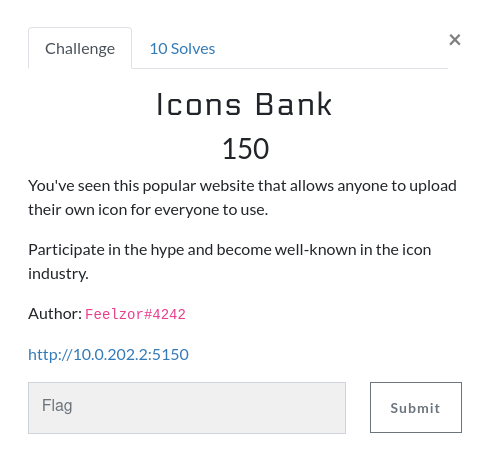
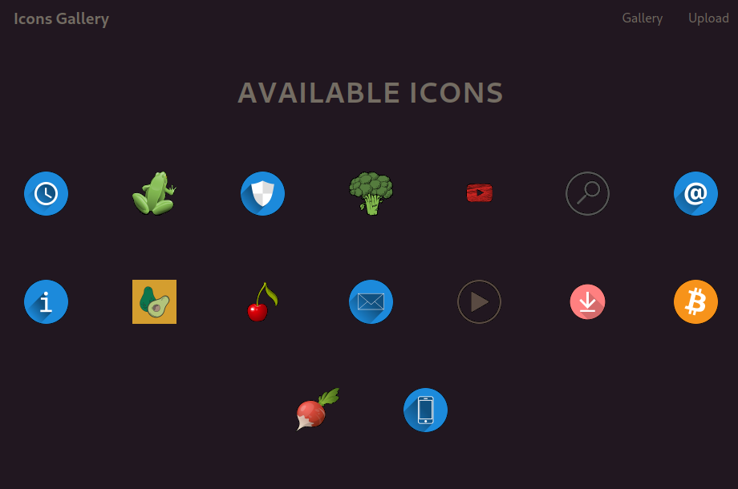
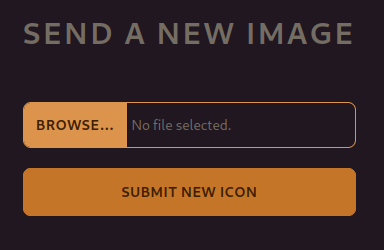

# Icons Bank

 

This is a challenge that I created. Therefore, I only present to you the expected way to solve it. It should contain just enough steps to understand what is going on, but may lack other tests and techniques that you would use during the CTF to solve such a challenge.

## Solving the challenge

When connecting to the challenge, we see this page.

Apart from the fact that I took all these pictures from Pixabay, there is one link that seems very important: the `Upload` link.

When you click on it, you arrive on another page, with `/?page=upload` in the URL.

If you send anything else than a PNG file, it responds with "Only PNG files are supported yet". No matter the extension of the file, it is only a matter of the file looking like a PNG.

With these informations, it should be a little bit clearer that the challenge may be something with uploading a PNG file containing a PHP payload, and including it with a LFI.

After some tries, you discover that:

- Files are compressed and resized to 55x55

- Any file is renamed to SHA256.png, even if you upload a .php file.

## The exploit

The idea of the challenge came from [this post from Synacktiv](https://www.synacktiv.com/publications/persistent-php-payloads-in-pngs-how-to-inject-php-code-in-an-image-and-keep-it-there.html). It explains what the problem is and how to exploit it, I highly recommend you read it before continuing. By following the **Method 4 - IDAT Chunk** you are able to solve the challenge. There are other posts about that on the internet and this technique has been documented for years now. 

By following the steps described in the article, you come with a little image (110x110) that you can upload on the website. After the upload, you retrieve the URL of the uploaded image (for me `uploads/d531bfd92550547e11000e6ff1bf9a84afdc543a0329b352cedaf4fb362b37bb.png`).

Since we are on `/?page=upload`, let's try to make a LFI: `/?page=uploads/d531bfd92550547e11000e6ff1bf9a84afdc543a0329b352cedaf4fb362b37bb.png`, which works! You should see the contents of the PNG file, with lots of weird symbols showing up. This is probably because the file is not imported as an image but with an `include`, `require` or any other PHP include function.

If you inspect your network (in the browser), you realize that the server properly responds but contains a 500 response code. So what is happening?

The image contains the payload `<?=$_GET[0]($_POST[1])?>`, and I am sending a `GET` request yet, without any parameter, which makes PHP crash.

With `/?page=uploads/yourupload.png?0=shell_exec` with POST arg `1=ls`, you can see that the exploit properly works, and you only have to find the flag (located in `/var/www/.flag`, or `../.flag`).

**Flag:** `GH22{c0mpression_does_not_prot3ct_from_png_execut1on}`

## Problems

### The non-existing XSS bot

We frequently see that our challenges do not behave in the way we expect. Mine is no exception, and I have found myself having set "Your file has been uploaded and is under review by an administrator" only to make the challenge more realistic (the idea is that you don't want to wait for the admin to validate).

However multiple participants thought that a bot would crawl their image and validate them (mainly because at the start of the CTF, the upload was broken and the image would not show up after the upload).

Due to a misconfiguration and a message that confuses participants, I had to make an announcement that no bot was crawling the website to make clear that no XSS was possible. Sometimes RP is cool, but sometimes it is confusing and next time I'll try to make sure that my messages do not cause any confusion.

### Uploads being broken

When the challenge has been up for the first time, I've had several reports that the image appeared broken when uploaded. This was not intended and we had to search for the cause.

Most likely the problem was that the uploads folder was being mounted as a volume in my compose file, and the rights were not the same between the machine and the docker, therefore `www-data` was not able to write inside `/var/www`.

We've fixed that, as well as changed relative paths to absolute paths to be absolutely sure that we would not have any problem with this chall during the rest of the day.

Thanks to the whole infra team, we've been able to fix the challenge in a few minutes and I've learnt new ways to create my challenges so that won't happen in the future:

- Never use the same folder for pre-existing uploads and user uploads.

- Use as much read-only as you can, and use `tmpfs` whenever needed (would be very nice for uploads).

- Use absolute paths everywhere you can, since you are in control of your compose file.

With that in mind, I swear to the infra team that next year will be easier for them to use my challenges. Forgive me for what I've done.

(that is me when I give my buggy challenge to the infra team)
